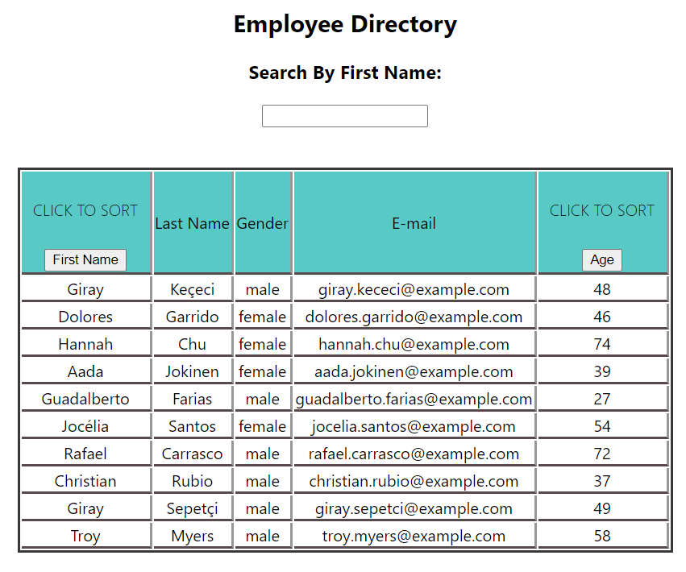

# React Employee Directory

## Description

A React application that allows the user to sort information in a directory by first name and age and filter by letter. This application utilizes an api to generate random names. It utilizes elements of React such as context and state.

# Table of Contents

- [Description](#Description)
- [Table of Contents](#Table-Of-Contents)
- [Installation](#Installation)
- [Usage](#Usage)
- [Contributing](#Contributing)
- [License](#License)
- [Tests](#Tests)

## Installation

Use the package managers

- [axios] (https://www.npmjs.com/package/axios)

```bash
npm install dependencies
```

## Usage

```Click "First Name" and "Age" buttons to sort alphabetically and by incrementing numbers. Type the letters in the input area to filter the names.

```



## Contributing

pull requests are welcome, but requests are a necessity before you make changes.

## License

[MIT](https://opensource.org/licenses/MIT)

## Deployed Application

https://halowe94.github.io/employeeDirectory/

## Questions

For more info, click here:
https://github.com/halowe94
